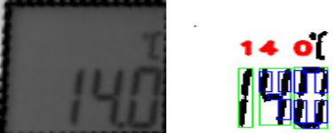

# ocr_digital

Digits detector for the 7-segments screen of a thermometer.




The method was inspired by this [PyImageSearch post](https://www.pyimagesearch.com/2017/02/13/recognizing-digits-with-opencv-and-python/), and adapted for my specific use case (different shape of thermometer, and less contrasted segments). It would probably not work right away with any other thermometer or 7-segments display, but could probably be tuned for it.

Sample images can be found in the `data` folder, the detector performs relatively well with these. Over the 210 images, only 3 are detected wrongly (and 1 error was caused by a digit changing while capturing the image).

## Setup and usage
This has been tested on Ubuntu 20.04, with Python 3.8 and OpenCV 4.2.

```bash
sudo apt update
sudo apt install libopencv-dev python3-opencv

git clone https://github.com/CorentinChauvin/ocr_digital.git
cd ocr_digital
pip3 install -r requirements.txt

python3 example.py
```

For basic usage:
```python
import cv2
from src.digital_detector import DigitalDetector

image_path = "..."  # FIXME
img = cv2.imread(image_path)
temperature = detector.detect_digits(img, display_debug=True)
```
